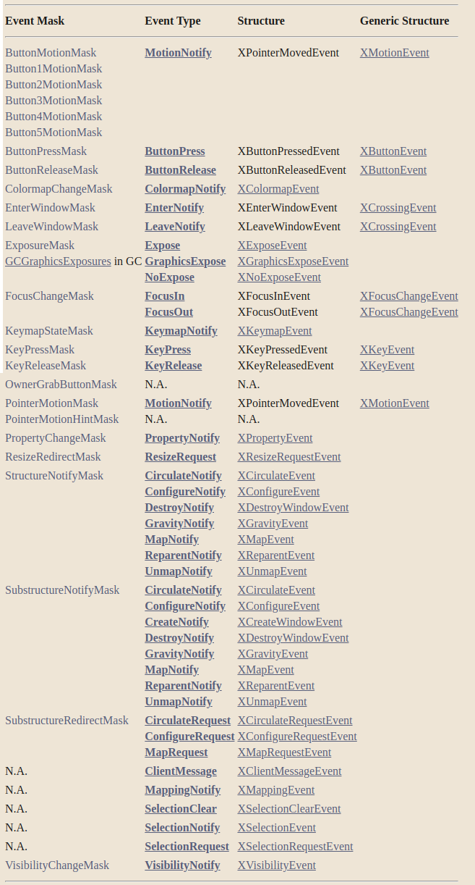

> 在事件处理过程中，**报告**给客户端应用程序的**事件**取决于为**窗口提供的事件掩码**属性
>
> 某些事件掩码，在事件掩码常数和事件类型常数之间存在着一对一的对应关系

* 传递事件掩码`ButtonPressMask`，X服务器就只发回`ButtonPress`事件
  * 大多数事件包含一个时间成员，代表事件发生的时间
* 其他情况下，一个事件掩码常数可以映射到几个事件类型常数
  * 传递事件掩码`SubstructureNotifyMask`，X服务器可以发回`CirculateNotify`、`ConfigureNotify`、`CreateNotify`、`DestroyNotify`、`GravityNotify`、`MapNotify`、`ReparentNotify`或`UnmapNotify`事件
* 另一种情况下，两个事件掩码可以映射到一个事件类型
  * 如果传递`PointerMotionMask`或`ButtonMotionMask`，X服务器就会发回一个`MotionNotify`事件
* 下表列出了事件掩码、其相关的事件类型或类型，以及与事件类型相关的结构名称
  * 一些结构实际上是对两个事件类型之间共享的通用结构的类型化定义
  * `N.A.`出现在信息不适用的栏目中
  * 

##### 选择不同掩码时使用的处理

* [键盘和指针事件]()
* [窗口穿越事件]()
* [输入焦点事件]()
* [键图状态通知事件]()
* [曝光事件]()
* [窗口状态通知事件]()
* [结构控制事件]()
* [色表状态通知事件]()
* [客户端通信事件](./process_event/client_communication_events.md)
  * 重点看这个

