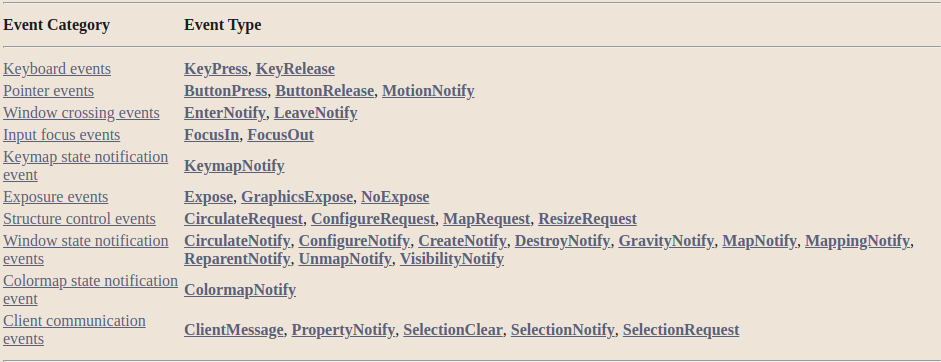

> 事件是由X服务器**异步生成**的**数据**，是一些**设备活动的结果**，或者是由`Xlib`函数发送的**请求的副作用**
>
> 与设备相关的事件从**源窗口传播到祖先窗口**，直到某个**客户程序选择了该事件类型**，或者事件被**明确地丢弃**
>
> X服务器通常只在客户端特别要求被告知该事件类型的情况下才会向客户端应用程序发送事件，通常是通过设置窗口的事件掩码属性
>
> 掩码也可以在你创建窗口时设置，或者通过改变窗口的事件掩码
>
> 可以通过操作窗口属性的 "不传播 "掩码来屏蔽那些会传播到祖先窗口的事件。然而，`MappingNotify`事件总是被发送到所有客户端
> 一个事件类型描述了一个由X服务器产生的特定事件
>
> 对于每个事件类型，在`X11/X.h`中定义了一个相应的常量名称，在引用事件类型时使用

下表列出了事件类别和其相关的事件类型或类型。与这些事件相关的处理在 "事件处理概述 "一节中讨论

