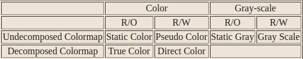

> 某些显示硬件上，有可能以不止一种方式处理颜色资源
>
> * 处理一个12位深度的屏幕，像素与颜色的任意映射（伪色）或24位深度的屏幕，像素的8位专门用于红、绿、蓝三色
>
> **处理**屏幕视觉方面的**不同方式**被称为**视觉**
>
> * 对于显示器的**每个屏幕**，可能有一个在**不同深度的屏幕**上支持的**有效视觉类型的列表**
> * 默认的窗口和视觉类型是为每个屏幕定义的，大多数简单的应用程序**不需要处理这种复杂性**
>
> `Xlib`提供了返回默认根窗口、默认根窗口的默认深度和默认视觉类型的宏和函数（见 "显示宏 "和 "确定适当的视觉类型"）

* 使用一个不透明的Visual结构，它包含可能的颜色映射的信息
* 视觉工具函数（见 "确定合适的视觉类型"）使用`XVisualInfo`结构来返回这些信息给应用程序

---

屏幕可以是彩色的，也可以是灰度的，可以有一个可写或只读的颜色映射，也可以有一个颜色映射，其索引被分解成独立的`RGB`片，只要不是在灰度屏幕上

当每个像素从视频存储器中读出并显示在屏幕上时，它要经过一个**查找阶段**，即**索引**到一个**颜色映射**

某些硬件上可以任意操作颜色映射，在其他硬件上可以以有限的方式操作，而在其他硬件上则完全不可以

##### 视觉类型以下列方式影响颜色映射和`RGB`值

* 对于`PseudoColor`，一个像素值索引一个颜色映射以产生独立的`RGB`值，而且`RGB`值可以动态改变
* 灰度的处理方式与伪彩色相同，只是驱动屏幕的主色是未定义的
  * 因此，客户端应该始终在颜色图中为红、绿、蓝存储相同的值
* 对于`DirectColor`来说，一个像素值被分解成独立的`RGB`子字段，每个子字段都为相应的值单独建立了颜色映射的索引。`RGB`值可以动态地改变
* `TrueColor`的处理方式与`DirectColor`相同，只是颜色映射有预定义的、只读的`RGB`值
  * `RGB`值与服务器有关，但在每个主色中提供了线性或接近线性的斜率
* `StaticColor`的处理方式与`PseudoColor`相同，只是颜色映射有预定义的、只读的、依赖于服务器的`RGB`值
* `StaticGray`的处理方式与`StaticColor`相同，只是`RGB`值对于任何一个像素值都是相等的，因此会产生灰色阴影
  * 有两个入口的颜色映射的`StaticGray`可以被认为是单色的

red_mask、green_mask和blue_mask成员只为`DirectColor`和`TrueColor`定义

* 每个成员都有一个连续的位集，没有交叉点
* `bits_per_rgb`成员指定了红色、绿色和蓝色的不同颜色值（单独）的对数基数2
* 实际的`RGB`值是无符号的16位数字
* `colormap_size`成员定义了新创建的`colormap`中可用的`colormap`项的数量
* 对于`DirectColor`和`TrueColor`，这是一个单独的像素子域的大小

要从一个Visual中获得视觉ID，请使用`XVisualIDFromVisual()`

