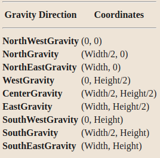

##### 位引力

* 窗口被调整大小时，窗口的哪个区域应该被保留
* 默认值是 `ForgetGravity`

##### 窗口引力

* 窗口被调整大小时应该如何重新定位
* 默认值是`NorthWestGravity`
* 如果窗口的内部高度没有改变，如果窗口被移动或其边界被改变，那么窗口的内容就不会丢失，而是随着窗口移动
* 改变窗口的内部宽度或高度会导致其内容被移动或丢失（取决于窗口的位引力），并导致子窗口被重新配置（取决于其赢引力）

##### 宽高对

* 当一个具有这些位引力值之一的窗口被调整大小时，相应的一对定义了窗口中**每个像素的位置变化**

* 当一个具有这些位-重力值之一的窗口的**父窗口被调整大小**时，相应的一对定义了窗口在父窗口中的位置变化
  * 当一个窗口被重新定位时，会产生一个`GravityNotify`事件
* `StaticGravity`的位引力表示内容或原点不应该相对于根窗口的原点移动
  * 如果窗口大小的变化与位置（x, y）的变化相配合，那么对于位-重力来说，每个像素的位置变化是（-x, -y），而对于赢-重力来说，当它的父辈被如此调整大小时，子辈的位置变化是（-x, -y）
  * `StaticGravity`仍然只在窗口的宽度或高度改变时生效，而不是在窗口被移动时生效
* `ForgetGravity`的位引力表示窗口的内容在尺寸改变后总是被丢弃，即使已经请求了备份或保存下
  * 窗口与它的背景平铺，并产生0个或更多的Expose事件
  * 如果没有定义背景，现有的屏幕内容就不会被改变
  * 一些X服务器可能也会忽略指定的比特重力，而总是产生Expose事件

* 下级的内容和边框不受其父级的比特重力的影响
  * 一个服务器被允许忽略指定的位引力并使用 "忘记 "来代替
* `UnmapGravity`的`win-gravity`与`NorthWestGravity`一样（窗口不被移动），只是当父体被调整大小时，子体也被取消映射，并产生`UnmapNotify`事件

