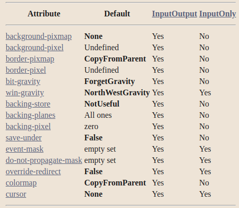

##### 窗口属性

* 所有`InputOutput`窗口都有一个0或更多像素的边框宽度，一个可选的背景，一个事件抑制掩码（抑制来自子代的事件传播），以及一个属性列表（见 "属性和原子"）
* 窗口的边框和背景可以是纯色的，也可以是一个图案，称为瓦片
* 除根部外，所有的窗口都有一个父级，并被其父级剪切
* 如果一个窗口被堆叠在另一个窗口之上，它就会在输入时遮挡住另一个窗口
* 如果一个窗口有背景（几乎所有的窗口都有），它在输出时就会遮住其他窗口
* 试图向被遮挡的区域输出的行为不会发生，也不会为被遮挡的区域产生任何输入事件（例如，指针移动）

##### 输入输出窗口和仅输入窗口的共同属性

* [引力](./attr/gravity_attr.md)
* 事件掩码 event mask
  * 定义了客户对于某些事件类型(这个窗口的下级）感兴趣的事件
  * 事件掩码是零个或多个有效的事件掩码位 | 的结果
  * 通过设置`NoEventMask`（默认）来指定不报告可屏蔽事件
* 不传播屏蔽 do-not-propagate-mask
  * 当没有客户端在这个窗口中选择事件类型时，哪些事件不应该被传播到祖先窗口
  * 以下掩码中零个或多个掩码的位数 | 结果
    * `KeyPress, KeyRelease, ButtonPress, ButtonRelease, PointerMotion, Button1Motion, Button2Motion, Button3Motion, Button4Motion, Button5Motion, and ButtonMotion`
  * 通过设置`NoEventMask`（默认）来指定所有事件都被传播
* 覆盖重定向标志 Override Redirect Flag
  * 控制窗口的位置或增加装饰，窗口管理器经常需要**拦截（重定向）**任何映射或配置**请求**
  * 弹出式窗口经常需要在没有窗口管理器的情况下被映射
  * 控制窗口是否要忽略这些结构控制设施，可以使用`overrid-redirect`标志
    * 指定该窗口的映射和配置请求是否应**覆盖父窗口**的 `SubstructureRedirectMask`
  * 将`overrid-redirect`标志设置为True或False（默认）
  * 窗口管理器使用这一信息来避免**篡改弹出式窗口**（另见 "客户端间通信功能"）
* 游标 cursor
  * 指定了当指针在窗口中时要使用**哪个游标**
  * 将光标设置为一个光标或无（默认）
  * 把游标设置为None，当指针在窗口中时，就会使用父代的游标，父代游标的任何改变都会导致显示的游标立即改变
  * 调用`XFreeCursor()`，只要不再对游标进行显式引用，游标就可以立即被释放

---

> 设置除了以上的其他窗口属性，会导致`BadMatch`错误

`InputOnly` 窗口用于在没有必要使用 `InputOutput` 窗口的情况下控制输入事件

`InputOnly` 窗口是不可见的；只能用于控制诸如光标、输入事件生成和抓取等；并且不能用于任何图形请求

请注意，`InputOnly`窗口不能有`InputOutput`窗口作为下级

窗口有可编程的宽度和图案的边框，以及背景图案或瓦片。像素值可以用于纯色。背景和边框像素图可以在创建窗口后立即销毁，如果不再明确引用它们的话。图案可以是相对于父对象的，也可以是绝对的。如果是`ParentRelative`，则使用父级的背景。


* 当窗口第一次被创建时，它们在屏幕上是**不可见**的（未被映射）

* 任何输出到屏幕上不可见的、没有后备存储的窗口将被丢弃

* 一个应用程序可能希望在一个窗口被映射到屏幕前很久就创建它
* 当一个窗口最终被映射到屏幕上时（使用`XMapWindow()`），如果备份存储（backing store）没有被维护，X服务器就会为该窗口生成一个暴露(expose)事件

* 窗口管理器可以覆盖你对顶级窗口的尺寸、边框宽度和位置的选择
* 程序必须准备好使用顶级窗口的实际尺寸和位置。
  * 除非是直接响应人类的命令，否则客户端应用程序调整自己的大小是不可接受的
  * 相反，你的程序应该使用给它的空间，或者如果空间太小，无法进行任何有用的工作，你的程序可以要求用户调整窗口的大小。
  * 你的顶级窗口的边界被认为是窗口管理器的公平游戏

* 要设置一个窗口的属性，请设置`XSetWindowAttributes`结构的相应成员，并在随后调用`XCreateWindow()`和`XChangeWindowAttributes()`时OR入相应的值位掩码，或者使用其他设置相应属性的便利函数之一。
* 值屏蔽位和`XSetWindowAttributes`结构的符号是

```c
/* Window attribute value mask bits */

#define CWBackPixmap		(1L<<0)
#define CWBackPixel		(1L<<1)
#define CWBorderPixmap		(1L<<2)
#define CWBorderPixel		(1L<<3)
#define CWBitGravity		(1L<<4)
#define CWWinGravity		(1L<<5)
#define CWBackingStore		(1L<<6)
#define CWBackingPlanes		(1L<<7)
#define CWBackingPixel		(1L<<8)
#define CWOverrideRedirect	(1L<<9)
#define CWSaveUnder		(1L<<10)
#define CWEventMask		(1L<<11)
#define CWDontPropagate		(1L<<12)
#define CWColormap		(1L<<13)
#define CWCursor		(1L<<14)


/* Values */

typedef struct {
	Pixmap background_pixmap;	/* background, None, or ParentRelative */
	unsigned long background_pixel;	/* background pixel */
	Pixmap border_pixmap;		/* border of the window or CopyFromParent */
	unsigned long border_pixel;	/* border pixel value */
	int bit_gravity;		/* one of bit gravity values */
	int win_gravity;		/* one of the window gravity values */
	int backing_store;		/* NotUseful, WhenMapped, Always */
	unsigned long backing_planes;	/* planes to be preserved if possible */
	unsigned long backing_pixel;	/* value to use in restoring planes */
	Bool save_under;		/* should bits under be saved? (popups) */
	long event_mask;		/* set of events that should be saved */
	long do_not_propagate_mask;	/* set of events that should not propagate */
	Bool override_redirect;		/* boolean value for override_redirect */
	Colormap colormap;		/* color map to be associated with window */
	Cursor cursor;			/* cursor to be displayed (or None) */
} XSetWindowAttributes;
```

* 下面列出了每个窗口属性的默认值，并指出该属性是否适用于`InputOutput`和`InputOnly`窗口
  * 


